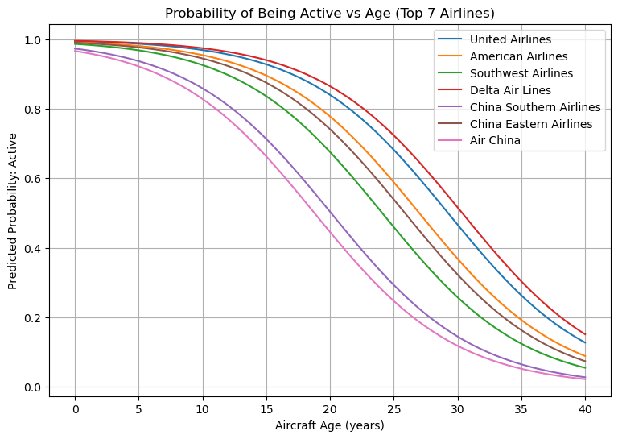
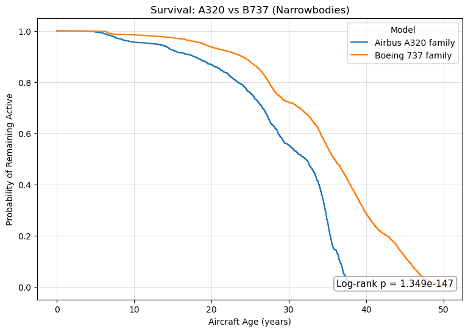
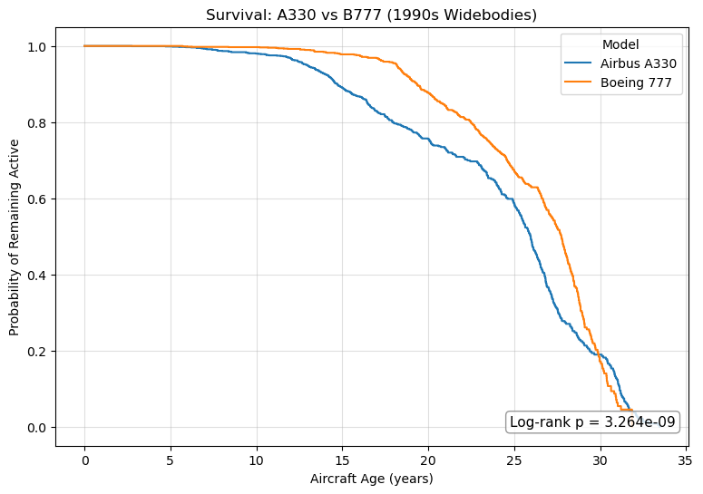
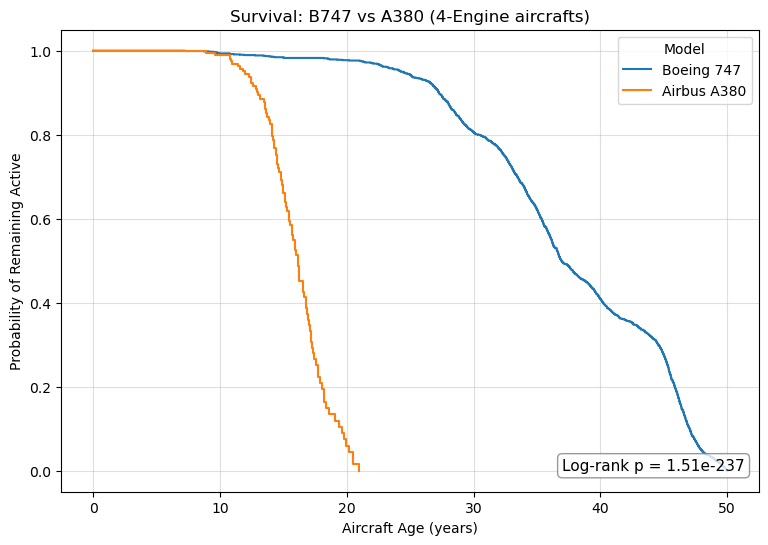
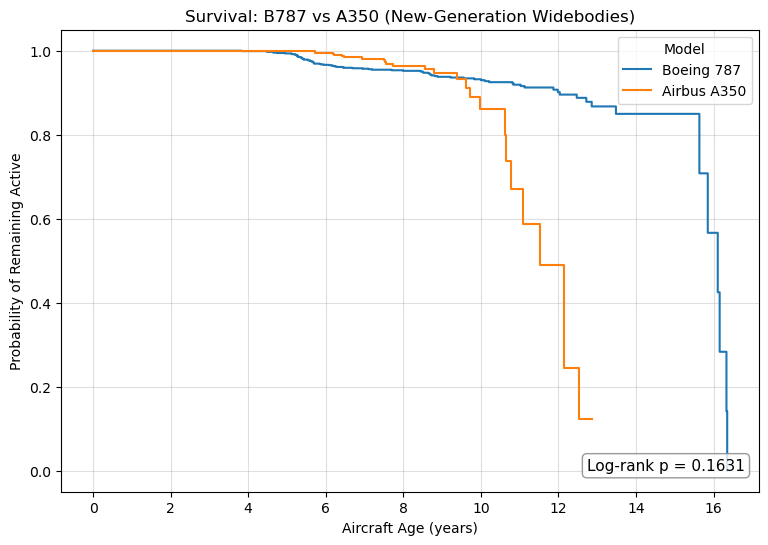
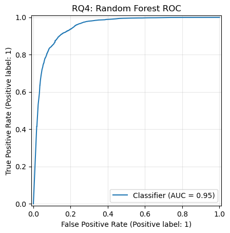
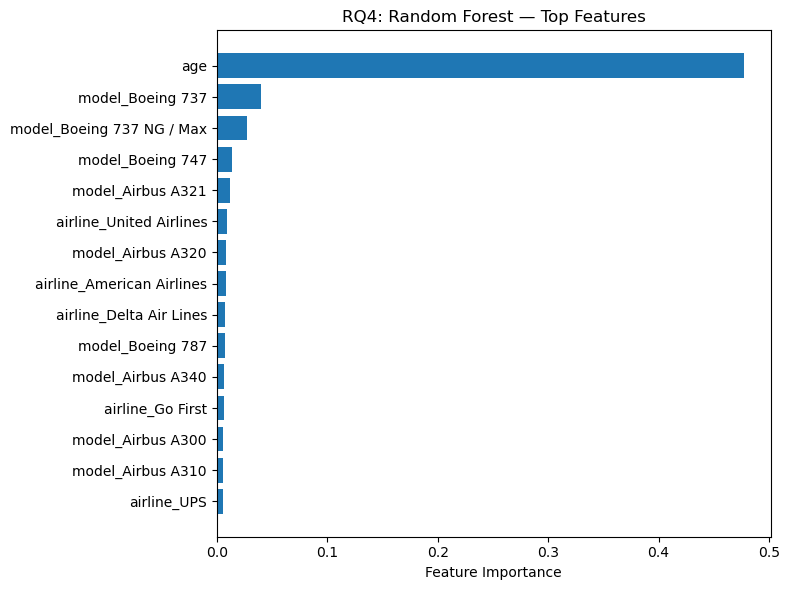
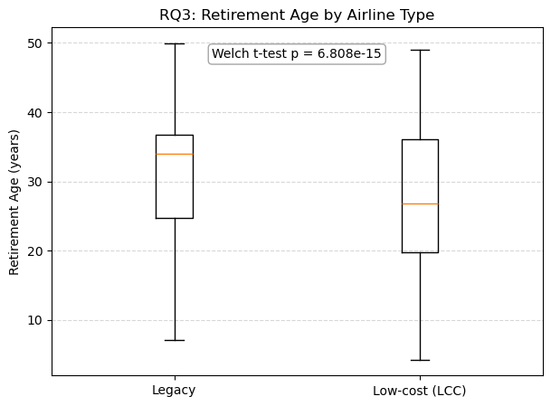

# Aircraft Survival Analysis

## Overview
This project analyzes aircraft lifecycle patterns using survival analysis and machine learning to understand retirement behavior.

## Data
- aircraft_data.csv (cleaned aircraft lifecycle dataset)

## Methods
- Kaplan-Meier survival curves  
- Log-rank test  
- Logistic regression  
- Random forest classification  

## Model Performance
- Logistic Regression AUC: ~0.90+  
- Random Forest AUC: ~0.95  
- Strong ability to distinguish active vs retired aircraft  

## Key Findings
- Aircraft are much less likely to remain active after ~20–25 years  
- Significant differences exist across aircraft models (log-rank test, p < 0.05)  
- Aircraft age is the strongest predictor of retirement  
- Airline and model contribute secondary effects  

## Visualization

### Logistic Regression


### Model Comparison





### ROC Curve


### Feature Importance


### Retirement Age Comparison


## Project Structure

```
Plane-Research/
├── figures/                     # Visualization outputs
├── Plane.ipynb                  # Main analysis notebook
├── aircraft_data.csv            # Dataset
├── Plane Research Report.pdf    # Full report
└── README.md
```


## Author
Kaitao Liao
